# 1. Prerequisites:
## - [ansible](https://docs.ansible.com/ansible/latest/installation_guide/intro_installation.html)
## - [docker](https://docs.docker.com/get-docker/)
### To generate an example config file (a "disabled" one with all default settings, commented out):
```ansible-config init --disabled > ansible.cfg```
### Setup passwordless ssh on remote servers.
### Create virtualenvs on remote servers.
```mkdir -p ~/.virtualenvs``` \
```cd ~/.virtualenvs``` \
```virtualenv dev-env``` \
```source dev-env/bin/activate``` \
```pip3 -V``` \
```pip3 list``` \
```pip3 install paramiko``` \
```pip3 list```
### Install requirements.txt on remote servers.
```pip3 install -r requirements.txt```
### Accessing ansible documentation.
- List all modules \
```ansible-doc -l ```
- Display documentation for the ping module \
```ansible-doc ping```
## Create SSL Certificate suing openssl
```shell
openssl req -x509 -newkey rsa:4096 -keyout key.pem -out cert.pem -sha256 -days 365
```
## Create SSL Certificate using minica (Optional):
```bash
cd certs
minica --domains 'localhost'
```
# 2. Start Environment:
```bash
ansible-playbook playbook.yml --vault-password-file vault_password
```
## 2.1 Go to [https//localhost:8443](https//localhost:8443)
## *Only do steps [2.10](#2.10-Create-user) & [2.11](#2.11-Add-user-to-group)*
Anisble will configure most of the setup (2.3 - 2.9)
### Configure Keycloak
- ## 2.3 Create realm *demo*
- ## 2.4 Create client grafana:
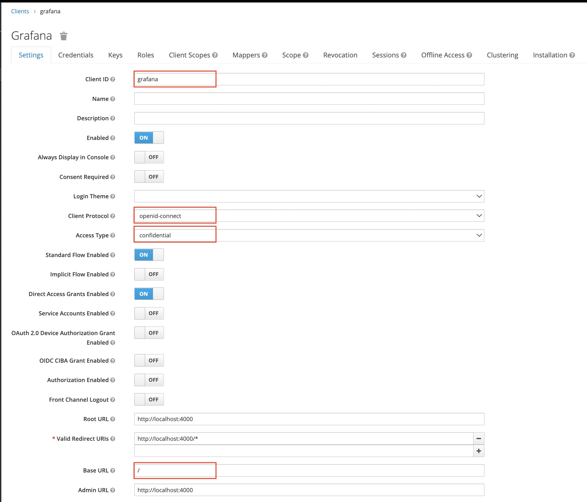
- ## 2.5 Copy secret to grafana config file:
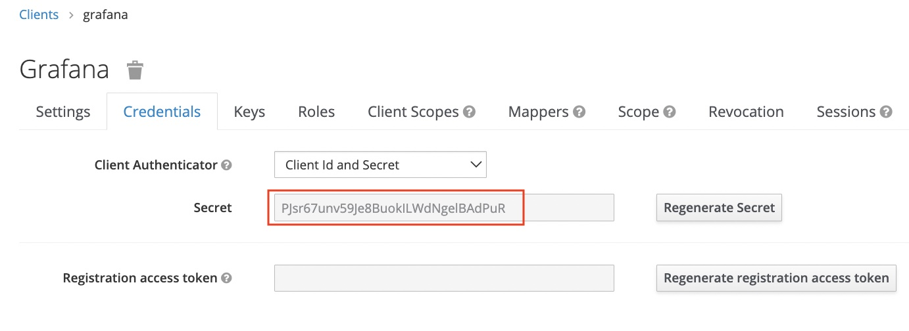
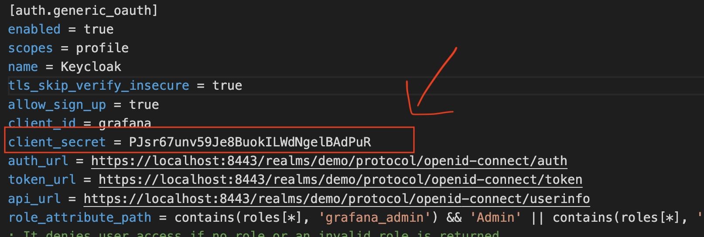
- ## 2.6 Create Roles:
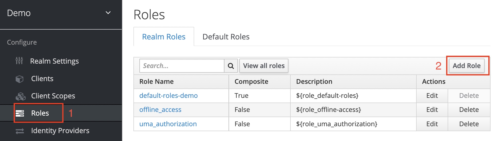
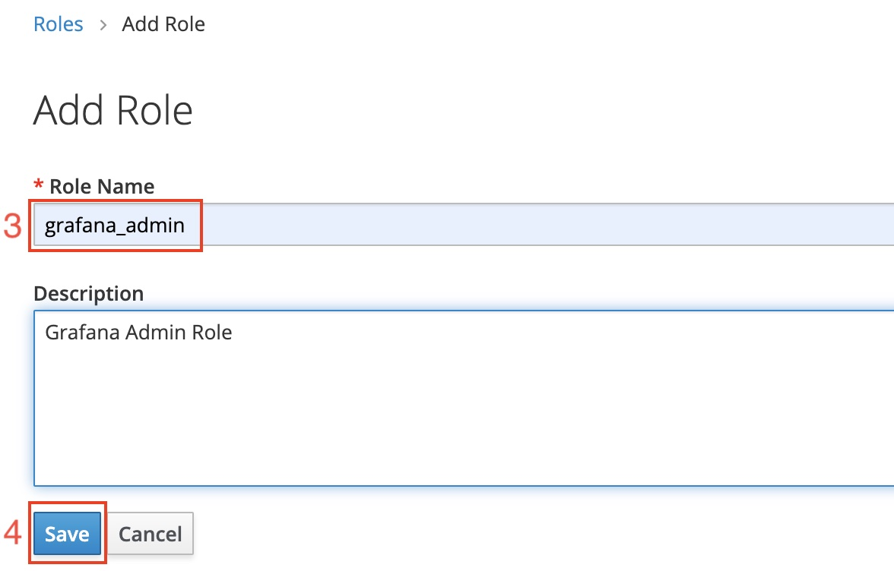
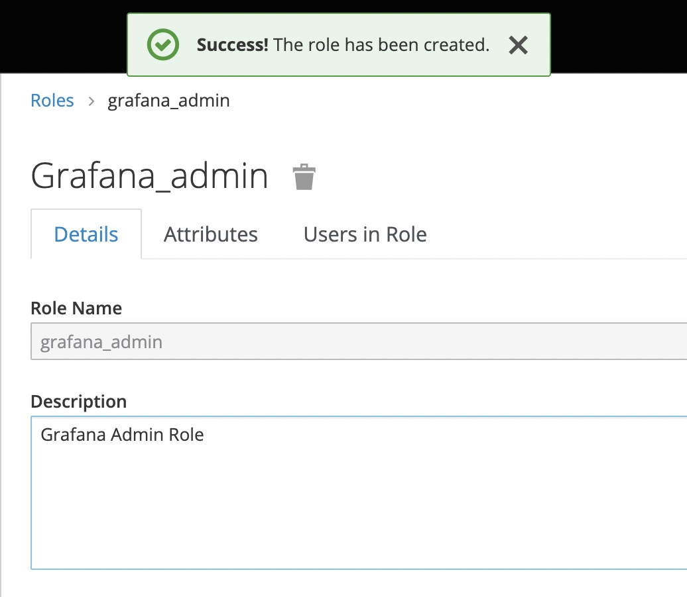
- ## 2.7 Create group(s) & Group mappings:
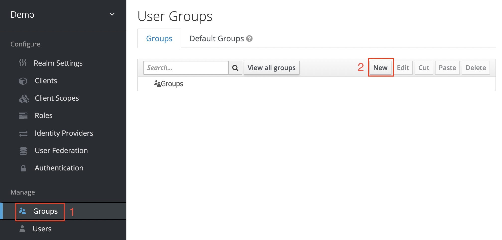
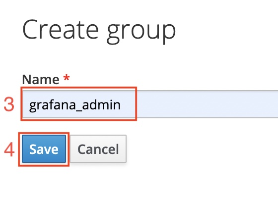
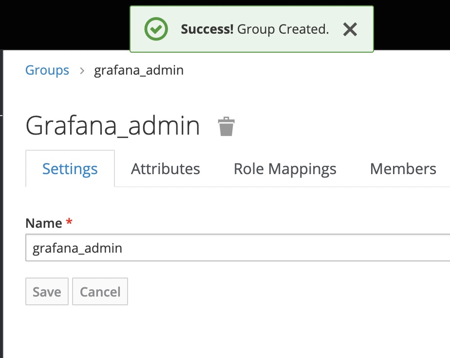
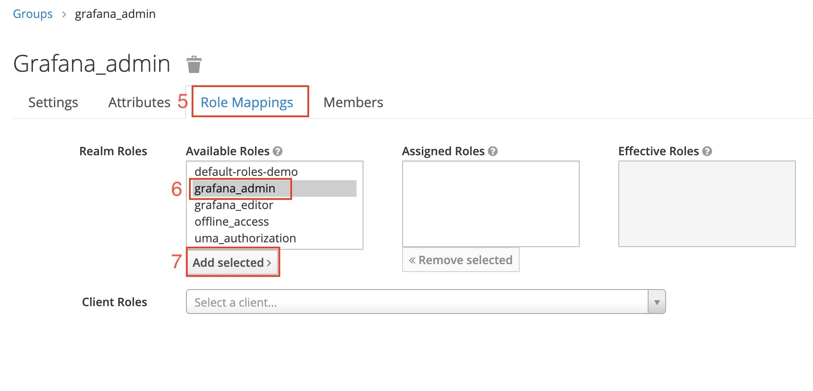
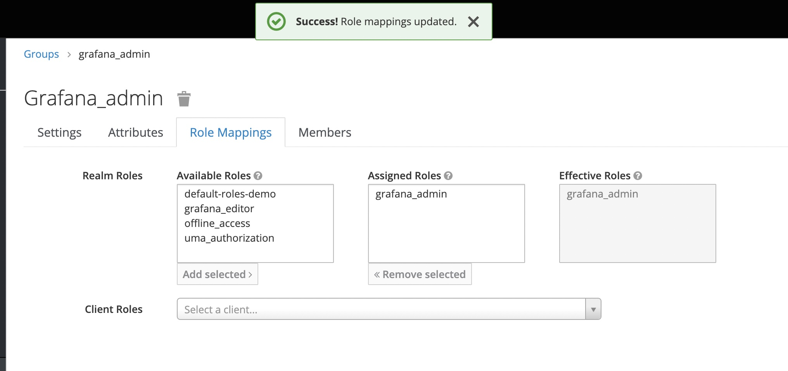
- ## 2.8 repeat for grafana_editor:
- ## 2.9 Create Client mappings:
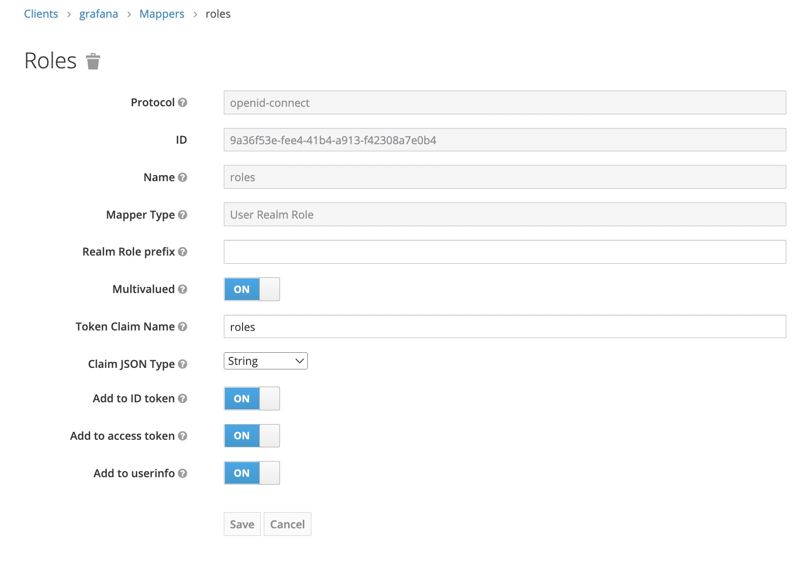
## 2.10 Create user
## 2.11 Add user to group
## Go to [https//localhost:8443](http//localhost:4000)
# Video

# References
- [Convert openssl .key file to .pem](https://gist.github.com/amolkhanorkar/10375087)
- https://docs.ansible.com/ansible/2.9/modules/docker_compose_module.html#docker-compose-module
- https://docs.ansible.com/ansible/latest/collections/community/general/keycloak_client_module.html
- https://github.com/Alfresco/alfresco-keycloak-theme
# Issues:
- https://cri.dev/posts/2020-07-06-How-to-solve-Docker-docker-credential-desktop-not-installed-or-not-available-in-PATH/
# Check Realm Endpoints:
```
{{server}}/realms/{{realm}}/.well-known/openid-configuration
```
```
https://localhost:8443/realms/demo/.well-known/openid-configuration
```